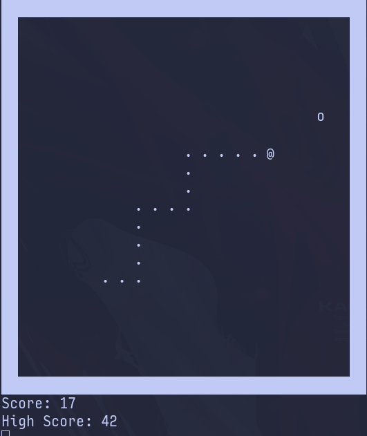

### Description
Classic Snake Game written in C and exclusively for Linux. Ported into C from [Porth](https://gitlab.com/tsoding/porth), with some added flairs!

### Screenshots


### Usage
```console
$ gcc -o snek snek.c && ./snek
```
### License
This project is licensed under the terms of the MIT license. See the LICENSE file for details.
